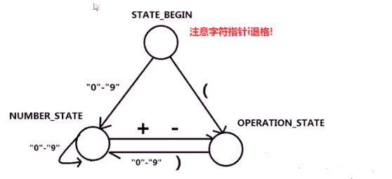

### 1: 使用队列实现栈 225
设计一个栈，支持基本的栈操作，这个栈的内部存储数据的结果为队列，队列的方法智能包括push、peek（front）、pop、size、enpty等标准队列方法

 思路
>对于队列：
q.push(x)   // 将元素 x 添加到队列中
q.pop()     // 弹出（移除）队列 头部 元素
q.front()   // 返回队列 头部 元素
q.back()    // 返回队列 尾部 元素
q.empty()   // 判断队列是否为空
q.size()    // 返回队列存储元素个数
>
>对于栈
s.top()     // 取出栈顶元素
s.empty()   // 判断栈是否为空
s.push(x)   // 将 x 添加至栈
s.pop()     // 弹出栈顶元素
s.size()    // 返回栈存储元素个数
~~~
1.
x 新元素push进入 临时队列 temp_queue，再把原队列 data_queue.front()  队列头部 内容push进入临时队列 temp_queue,并且data_queue.pop() 把队列头部元素出队
2.
将临时队列 temp_queue.front 头部元素push进入到 原队列 data_queue，data_queue.pop() 头部元素出队
~~~
>
>待插入元素 x
>data_queue 1 2 3 4 
>temp_queue x
>temp_queue 1 2 3 4 x
>data_queue 1 2 3 4 x
>实现由队列转栈的操作
>
### 2: 使用栈实现队列 232
设计一个队列，支持基本的队列操作，这个队列的内部存储数据的结构为栈，栈的方法只能包括push  top  pop  size  empty等标准的栈方法
> 思路
在 队列 push元素时，利用临时 栈 调换元素次序
1 将原数据栈 data_stack 内容 push 进入临时栈 temp_stack
2 将新数据 push 进入 临时栈 temp_stack
3 将临时栈 temp_stack 中的元素 push 进入 数据栈 data_stack

### 3: 包含 main 函数的栈  155
设计一个栈，支持如下操作，这些操作的算法复杂度需要是常数级，O(1)
1. push(x)   将元素 x 压入栈中
2. pop()     弹出（移除）栈顶元素
3. top()     返回栈顶元素
4. getMin()  返回栈内最小元素

> 思路
_data 栈存储数据，利用另一个栈 _min，存储各个状态最小值, 则_min.top() 返回的一定是 _data栈中最小的元素值。

### 4: 合法的出栈序列 poj.org 1363
已知从1至n的数字序列，按顺序入栈，每个数字入栈后即可出栈，也可在栈中停留，等待后面的数字入栈出栈后，该数字再出栈，求该数字序列的出栈序列是否合法？
> 思路： 使用栈与队列模拟入栈、出栈过程
1.出栈结果存储在队列 queue_order 中
2.按元素顺序，将元素push进栈s
3.每push一个元素，即检测是否与队列首部元素相同？若相同则弹出队列首元素，弹出栈顶元素，直到两元素不同结束
4.若最终栈为空，说明序列合法，否则不合法
~~~
bool check_is_valid_order(std::queue<int> &order) // 检测序列
{
    std::stack<int> S;  // S为模拟栈
    int n = order.size();  // n为序列长度，将1-n按顺序入栈
    for (int i = 1; i <= n; i++)  
    {
        S.push(i);   // 元素i入栈
        while (!S.empty() && S.pop() == order.front())
        {
            S.pop();    // 当队列头部和栈顶元素相等时
            order.pop()
        }
    }
    if (!S.empty())   // 如果栈不为空，就返回false，即不是合法的序列
        return false;
    return true;

}
~~~
### 5：简单的计算器  224
设计一个计算器，输入一个字符串存储的数学表达式，可以计算包括 （ ） + - 四种符合的数学表达式，输入的数学表达式字符串保证是合法的。输入的数学表达式中可能存在空格字符。

> 思路 难点在于处理字符串  使用状态机的思想
> i 指向字符串 S的第一个字符，如果 i 是“0-9"则进入NUMBER_STATE 处理数字，如果 i 是 “（”字符则进入OPERATION_STATE 处理字符

> NUMBER_STATE
>1) 如果为数字字符：
number = number * 10 + ch - '0';
>2) 否则：
number 进入数字栈 number_stack.push
根据 compute_flag进行计算
并且切换至OPERATION_STATE
并将字符指针 i 退格，number = 0

> OPERATION_STATE
>1) 如果 + -
operation_stack.push
compute_flag = 1
>2) 如果 (
compute_flag = 0
切换至NUMBER_STATE
>3) 如果 ）
进行计算 compute
>4) 如果 0-9
切换至NUMBER_STATE
注意字符指针 i 退格

~~~
int calculate(std::string s)
{
    static const int STATE_BEGIN = 0;
    static const int NUMBER_STATE = 1;
    static const int OPERATION_STATE = 2;
    std::stack<int> number_stack;
    std::stack<char> operation_state;
    int number = 0;
    int STATE = STATE_BEGIN;
    int compuate_flag = 0;
    for (int i = 0; i < s.length(); i++)
    {
        if (s[i] == ' ')    // 跳过空格
            continue;
        switch(STATE)       // 有限状态机
        {
            case STATE_BEGIN:   // 状态机处于开始状态
                if(s[i] > '0' && s[i] < '9')
                    STATE = NUMBER_STATE;
                else
                    STATE = OPERATION_STATE;
                i--;    // 不管s[i]是什么，都要退一格，把当前i交给下一个状态进行处理
                break;
            case NUMBER_STATE:  // 状态机处于数字状态
                if(s[i] > '0' && s[i] < '9')
                    number = number * 10 + s[i] - '0';
                else
                {
                    number_stack.push(number);  // 已经完整读取一个数字
                    if (compuate_flag == 1)     // 计算
                        compute(number_stack, operation_stack);
                    number = 0;                 // number置零
                    i--;                        // 如果不是数字，说明是字符，所以退一格，把当前i交给下个一状态进行处理
                    STATE = OPERATION_STATE;
                }
                break;
            case OPERATION_STATE:   // 状态机属于字符
                if (s[i] == '+' || s[i] == '-')
                {
                    operation_stack.push(s[i]);
                    compuate_flag = 1;
                }
                else if (s[i] == '(')
                {
                    compuate_flag = 0;
                    STATE = NUMBER_STATE;
                }     
                else if(s[i] > '0' && s[i] < '9')
                {
                    STATE = NUMBER_STATE;
                    i--；       // 同样，在字符状态出现数字，要把当前i交给数字状态处理
                }
                else if (s[i] == ')')
                    compuate(number_stack, operation_stack);
                break;
        }

    }
    if (number != 0)
    {
        number_stack.push(number);
        compute(number_stack, operation_stack);
    }
    if (number == 0 && number_stack.empty())
        return 0;
    return number_stack.top();
}
~~~
### 预备知识：STL优先级队列（二叉堆）
二叉堆，最小（大）值先出的完全二叉树
~~~
#include <stdio.h>
#include <queue>
int main() 
{
    std::priority queue<int> big_heap;  // 默认构造是最大堆
    std::priority queue<int， std::vector<int>, std::greate<int> > small_heap;  // 最小堆构造方法
    std::priority queue<int， std::vector<int>, std::less<int> > big_heap2;  // 最大堆构造方法

    if (big_heap.empty())   // 判断堆是否为空，返回bool
    {
        printf("big_heap is empty!\n");
    }

    int test[] = {6,10,1,7,99,4,33};
    for (int i = 0; i < 7; i++)
    {
        big_heap.push(test[i]);     // 元素插入到堆中，堆自动调整
    }
    print("big_heap.top = %d\n", big_heap.top());   // 返回堆顶元素
    big_heap.push(1000);
    print("big_heap.top = %d\n", big_heap.top());
    for (int i = 0; i < 3; i++)
    {
        big_heap.pop();             // 弹出堆顶元素
    }

    print("big_heap.top = %d\n", big_heap.top());
    print("big_heap.size = %d\n", big_heap.size()); // 返回堆的元素个数
    return 0;
}
~~~

### 6：数组中第K大的数  215 E
已知一个未排序的数组，求这个数组中第k大的数字
> 思路：
维护一个K大小的最小堆，堆中元素个数小于k时，新元素直接进入堆；
否则，当堆顶小于新元素时，弹出堆顶，将新元素加入堆。
扫描完所有元素后，堆顶就是第k大的数。
时间复杂度  N * logk
如果将数组排序，时间复杂度为 N * logN

### 7：寻找中位数 295 H
设计一个数据结构，该数据结构动态维护一组数据，且支持如下操作：
1.添加元素：void addNum(int num), 将整形num添加至数据结构中。
2.返回数据中的中位数： double finMedian(), 返回其维护的数据的中位数。
中位数定义：
a.若数据个数为奇数，中位数是该组数据排序后中间的数。[1,2,3]->2
b.若数据个数为偶数，中位数是该数据排序后中间两个数平均值。[1,2,3,4]->2.5
>思路 巧用堆的性质
动态维护一个最大堆和一个最小堆，最大堆存储一半数据，最小堆存储一半数据，维护最大堆的堆顶比最小堆的堆顶小。

> 情况1 最大堆、最小堆元素个数相同
新元素小于最大堆堆顶，添加到最大堆中；
新元素大于最大堆堆顶，添加到最小堆；

> 情况2 最大堆比最小堆多一个元素
新元素小于最大堆堆顶，将最大堆的堆顶push进入最小堆，堆顶元素pop，新元素push进入最大堆；
新元素大于最大堆堆顶，直接新元素push进入最小堆；

> 情况3 最大堆比最小堆少一个元素
新元素小于最大堆堆顶，新元素push进入最大堆；
新元素大于最大堆堆顶，将最小堆的堆顶push进入最大堆，堆顶元素pop，新元素push进入最小堆；

~~~
void addNum(int num)
{
    if (big_queue.empty())
    {
        big_queue.push(num);
        return;
    }

    if (big_queue.size() == small_queue.size())
    {
        if (num < big_queue.top()>)
            big_queue.push(num);
        else
            small_queue.push(num);
    }
    else if (big_queue.size() > small_queue.size())
    {
        if (num > big_queue.top())
            small_queue.push(num);
        else
        {
            small_queue.push(big_queue.top());
            big_queue.pop();
            big_queue.push(num);
        }
    }
    else if (big_queue.size() < small_queue.size())
    {
        if (num < big_queue.top())
            big_queue.push(num);
        else
        {
            big_queue.push(small_queue.top());
            small_queue.pop();
            small_queue.push(num);
        }
    }
}

double findMedian()
{
    if (big_queue.size() == small_queue.size())
        return (big_queue.top() + small_queue.top()) / 2;
    else if (big_queue.size() > small_queue.size())
        return big_queue.top();
    return small_queue.top();
}
~~~

